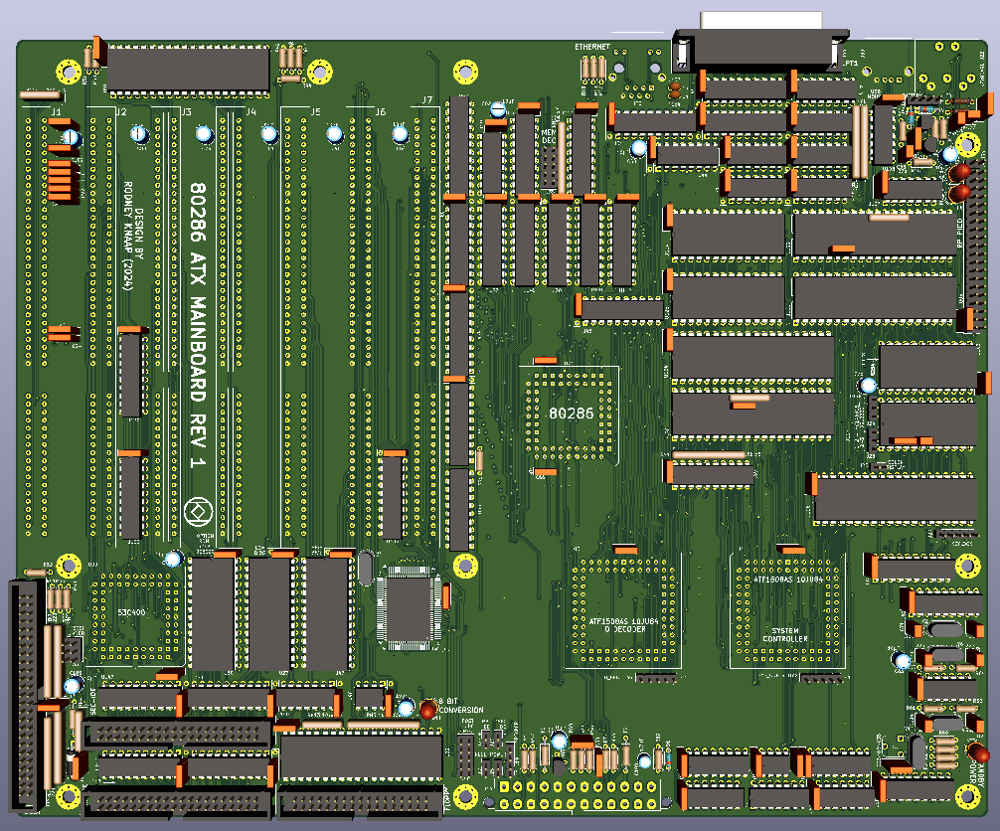
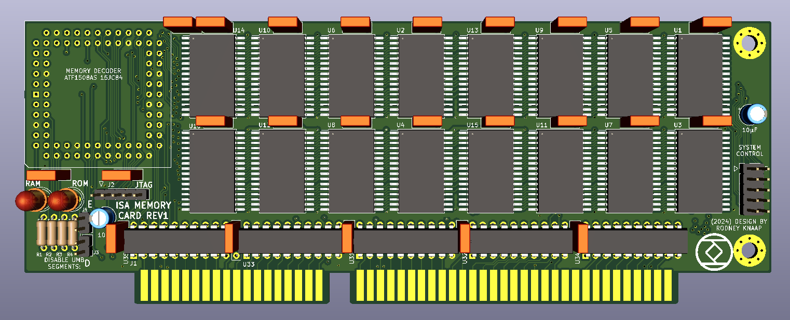
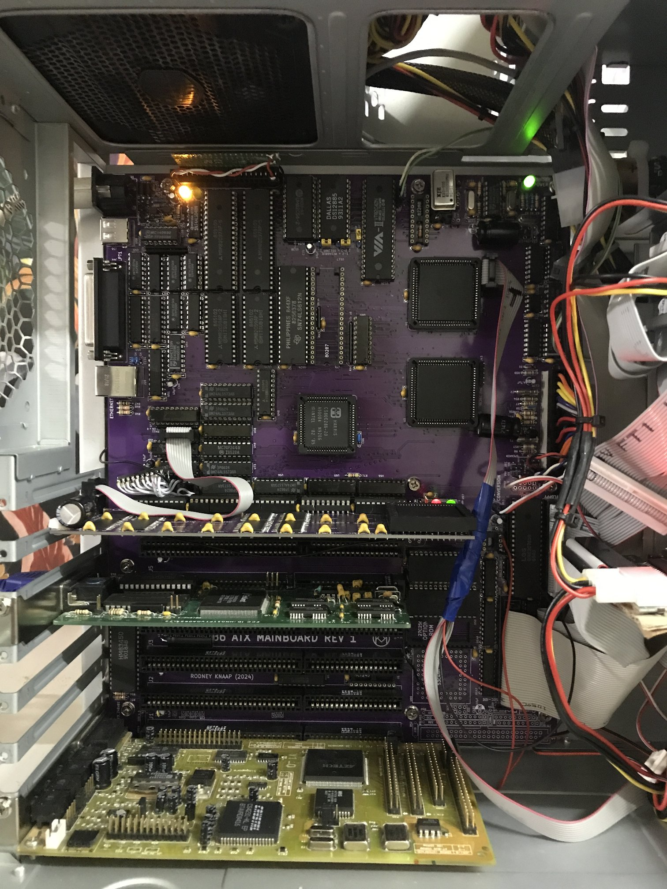
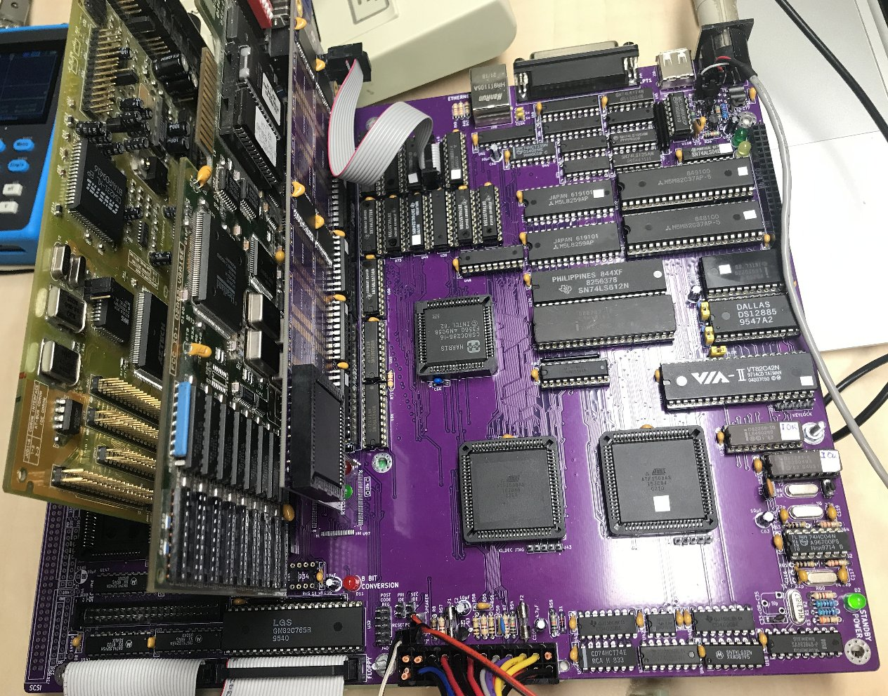

# ATX form factor 80286 AT mainboard PCB Rev 1







## Current status(okt 2024): This project is built, fully functional, now able to operate at 20MHz CPU speed.
See at the bottom for the latest developments!

The project consists of a ATX mainboard and a ISA memory card.

Purpose and permitted use, cautions for a potential builder of this design
This project was created for historical purposes out of love for historical computing designs and for the purpose of enabling computing enthousiasts with a sufficient level of building and troubleshooting expertise to be able to experience the technology by building and troubleshooting the hardware described in this project. Due to the level of this project, it may be suitable as a project for students to get into. If there are any questions from teachers who like to teach about this technology I would be happy to answer them. It may be really interesting to analyse the elaborate and complex CPU timing and 8 bit to 16 bit data byte translation and DMA mechanisms in an educational setting.

Besides the GPL3 license there are a few warnings and usage restrictions applicable:
No guarantees of function or fitness for any particular or useful purpose is given, building and using this design is at the sole responsibility of the builder.

Do not attempt this project unless you have the necessary electronics assembly expertise and experience, and know how to observe all electronics safety guidelines which are applicable.

It is not permitted to use the computer built from this design without the assumption of the possibility of loss of data or malfunction of the connected device. To be used strictly for personal hobby and experimental purposes only. No applications are permitted where failure of the device could result in damage or injury of any kind.

If you plan to use this design or any part of it in new designs, the acknowledgement of the designer and the design sources and inspirations, historical and modern, of all subparts contained within this design should be included and respected in your publication, to accredit the hard work, time and effort dedicated by the people before you who contributed to make your project possible.

No guarantee for any proper operation or suitability for any possible use or purpose is given, using the resulting hardware from this design is purely educational and experimental and not intended for serious applications. Loss of data is likely and to be expected when connecting any storage device or storage media to the resulting system from this design, or when configuring or operating any storage device or media with the system of this design.

When connecting this system to a computer network which contains stored information on it, it is at the sole responsibility and risk of the person making the connection, no guarantee is given against data loss or data corruption, malfunctions or failure of the whole computer network and/or any information contained inside it on other devices and media which are connected to the same network.

When building this project, the builder assumes personal responsibility for troubleshooting it and using the necessary care and expertise to make it function properly as defined by the design. You can email me with questions, but I will reply only if I have time and if I find the question to be valid. Which will probably also lead to an update here. I want to primarily dedicate my time to new project development, I am not able to do any user support, so that's why I provide the elaborate info here which will be expanded if needed.

# Acknowledgements

This project was inspired by:
- IBM Corporation who introduced the 16 bit AT concept after their PC and XT product lines
- concept and software of the XT-IDE universal BIOS https://www.xtideuniversalbios.org
- discussions with members of the German DOS Reloaded forum
https://dosreloaded.de/forum/thread/6811-diy-diskretes-logik-atx-turbo-at-286-mainboard-ohne-chipsatz/
- discussions with members of the VCF forum
https://forum.vcfed.org/index.php?threads/project-to-create-an-atx-80286-mainboard-based-on-the-ibm-5170.1243108/
I want to thank users Makefile, acgs, sergey, Timo W., sharkcz, Hpela, Alvaro64, Chuck(G), Theoryboy, modem7, Toportyán, Hak Foo, sorphin, ajacocks, Eudimorphodon, lowen, jonny64, HoJoPo, mogwaay, upnorth and sqpat for their responses, constructive ideas and discussions, and technical feedback!

In particular I want to thank Johann (jonny64) who took an active concern and participation in my project to help reverse engineer the PAL chips on the 5170 mainboard.
This process has been extremely difficult and Johann helped a lot by programming python scripts to quickly be able to analyze large volumes of logic equation information.
Resulting from our cooperation Johann has developed a reverse engineering python program called "pete" and a script which can generate the PAL fuse maps from reverse analysis which can be directly programmed into a GAL. He is planning, or has published his work in the mean time on GitHub so be sure to search for his project here if you are doing similar work on PAL ICs used in old devices.

User Alvaro64 from Spain was very kind to provide friendly discussions and various information and he even offered me to borrow his legacy Intel mainboard for checking and analysis.

I was happy to see some reactions from Sergey who also did some amazing work to design and build various classic PCs. He developed a BIOS of his own and a HD Floppy supporting BIOS extension.

User lowen gave me some very useful time saving tips in using CPLD programmable logic from Atmel/Microchip, to be able to more easily and quickly get started with suitable CPLD parts in this project.
This will be my first programmable logic project which I will explain below.
User Eudomorphodon provided me some valuable feedback in terms of which type of logic would be possible to exist within the IBM PALS which was a big issue and problem to determine exactly what IBM did in their PAL programming, literally costing me a few weeks. 
User sharkcz was very helpful for pointing me to the Copam PC-501 schematics where I found more clues about the 80287 coprocessor control circuits which are also located in a PAL on the IBM 5170.
User Chuck(G) also provided various information and wrote extensive useful information about PAL chips and how to reverse engineer them.

I thank Charles MacDonald for developing his PAL read adapter and PA.EXE software which reduces the logic equations.
As I mentioned, Johann(jonny64) developed his own version of a PAL analyzer named "pete" which can do a few more advanced things to be able to do very important logic reductions and conclusions on RAW PAL read data from Charles' adapter. Especially is "pete" able to detect certain inputs on a PAL which sometimes switch to operating as an output. So the scripts Johann made can conclude this mode of operation by itself and also can reduce the subsequent logic consequences of this operation mode in the logic equations. If we don't have this automatic function from pete, it will be the person doing the analysis who will need to reason what is happening back from the observations, which is what I have initially done myself, it was quite a frustrating process to discover what was happening exactly inside the PAL U87 which caused me a lot of stress and lost sleep!

Also a special thanks goes out to user LimeProgramming (Adam) here on GitHub for making his excellent USB to serial mouse project with the RP2040!
https://github.com/LimeProgramming/USB-serial-mouse-adapter
He kindly agrees for his project to be integrated into mine in a modified form, thank you Adam!

Everyone who commented and replied to all my posts, thanks for your help and friendship!

- datasheets, application notes and specifications by:
Intel (80286 datasheet)
LG Semiconductors (Goldstar) (GM82C765 FDC, GM16C550)
Standard Microsystems Corporation (FDC37C65C datasheet, FDC register access table)
Realtek (RTL8019AS)
NCR (53C400 SCSI)

Acknowledgements of people who were instrumental in preceeding developments upon which this design was elaborated:

[Don Estridge](https://www.ibm.com/ibm/history/exhibits/builders/builders_estridge.html)
[IBM PC development team](https://www.ibm.com/ibm/history/exhibits/pc25/pc25_birth.html)
[Some historical info](https://arstechnica.com/gadgets/2017/06/ibm-pc-history-part-1/)
[Bill Lowe](https://www.ibm.com/ibm/history/exhibits/builders/builders_lowe.html)

[XT-IDE universal BIOS project development team for developing the XT-IDE BIOS](https://www.xtideuniversalbios.org)
Amazing and extremely efficient software, fast disk access for XT and various AT computers.
Works with every IDE drive I have tested. Still under active development earlier in 2023.

All source data remains the copyright of the original creators and must be respected.
This design is only released for hobby computing enthousiasts and educational purposes, no profit is to be made from this design or derived work from it.

I have taken time to respectfully include all the above acknowledgements. This project has taken me almost a year up to the present time starting from all the research work I have done. If anyone or anything is left out, that is absolutely not intentional, please contact me and I will be happy to update this page further.

After elaborately studying the available source design files which inspired the system, I conceived this design with my own variations, circuit additions and changes which I see as improvements according to my personal design views and preferences. 

My purpose was a good and clear recreation in my own methods, and never to exactly copy the original. 
This project also serves to document the historical 16 bit AT PC design by implementing the fundamental concepts in a functional build which incorporates a lot of the original design concepts and functions which Don Estridge of IBM conceived. I admire Don and his work and I will attempt to explain in this text why his 16 bit AT concept was so important and elemental in promoting the industry standard development process!

I have designed various I/O control circuits using the chip manufacturer datasheets to determine the proper interfacing methods, ports etc suitable for this 286 AT design.
I also searched in many IO port documents to determine how to interface the onboard devices.

## How the project took more solid form

I started by finding a suitable mainboard for study, testing and analysis. I found a few examples from NCR and ARC however these proved to be frustratingly unstable and in a poorly operating condition. By no means would I have been able to base this project on those designs. Luckily I found an Ebay auction which offered an IBM 5170 mainboard for a very reasonable price. I repaired this mainboard and I have extensively tested it out. The IBM has the added advantage of being completely documented in their schematics which was very useful for this project.

I proceeded to draft modern KiCad schematics for the 5170 and subsequently modified the IBM designs to suit this project as much as possible. This involved removing the DRAM support logic and parity checking mechanisms from the schematics. Next I needed to reverse engineer the contents of PAL U87 which is elemental in the 5170 operation. Without the U87 design, a 5170 and its schematics will be useless and missing the vital operating circuits without which we have no AT! At the time there was not any documentation of the logic contained inside U87 to be found anywhere. So I proceeded to discover the logic by analysis. I used the method developed by Charles MacDonald initially and discussed with Johann to develop a utility program python script which I needed to form my conclusions about the actual operation of the U87 PAL.
Finally we succeeded to crack the design and even further simplify the logic equations of U87 to their most likely original PAL source code as originally created, probably by Don Estridge himself. If anyone has more information on how he developed the AT, please contact me, I am very much interested!

After I had the complete design of the 5170, I had to evaluate the large amount of logic chips which would be involved in case I would choose to use TTL chips only to implement the whole design. From the equations of U87, I could conclude why IBM chose this path of development. Adding all this additional logic would make the PCB even larger and make this whole concept impossible to properly implement on a single PCB in a practical PCB size. So I have concluded that I will need to use programmable logic in order to reduce the PCB area needed. And since I needed to use programmable logic anyway, I decided I had better do it properly to benefit from this concept the most. So I chose the ATF1508AS CPLD with the help and advice of user lowen. 

## Development path leading up to the first design revision
After reverse engineering PAL U87, I proceeded to draft schematics and did some initial parts placements on the mainboard. This quickly led me to conclude that in order to integrate many necessary devices onboard as planned, I would need to shift the entire memory subsystem and decoder CPLD onto a ISA adapter card. The BIOS and option ROM EPROMS are still placed on the mainboard because I like it more this way in a more traditional view of typical mainboards of the time.

I proceeded to draft my modified and new design of this project into schematics using KiCad and Quartus.

The complete design including my changes and additions is contained in and needs:
- a full ATX size mainboard PCB
- three 84 pin PLCC CPLDs which can be plugged into through-hole sockets
- a ISA memory subsystem card PCB containing the footprints for a total of 15MB of fully decoded SRAM memory.
This card provides 640KB of conventional memory, 128KB of UMBs at D0000 and E0000 segments with disable jumpers, and 14MB of XMS memory.
Each set of two 512KB SRAM ICs provides an additional megabyte of RAM for the system.
The amount of memory can be chosen by populating the desired amount of SRAM chips.
So basically this ISA slot card takes the function of the historically more typical DRAM SIMMs and implements the full PC memory space in SRAM memory.
Please note to observe the pin 1 mark of your particular RAM ICs and make sure you are not using a reversed pinout SRAM which would need to be soldered in flipped over orientation!

The mainboard provides two 16 bit IDE ports, a 8 bit SCSI port, a floppy drive interface, 16 bit Realtek LAN, USB to serial mouse using RP2040, discrete simplified LPT port, ATX power supply control, reset logic, and various LEDs to indicate certain system functions. The 64k BIOS is contained in two EPROMs on the mainboard and there is also a 32kb sized option ROM EPROM socket included on the mainboard. The design of this project is meant to use the XT-IDE BIOS option ROM software developed by XT IDE universal BIOS team, which needs to be configured and programmed into an option ROM EPROM IC which can be placed in the option ROM socket on the mainboard.

## My appreciation for Don Estridge and his amazing AT concept
IBM released the 5170 on the market for a price which no competitor on the PC market could equal at the time. For a long period of time, the AT went without any competition!
IBM even could not meet the demand of new units.
The 5170 offered substantial performance increases which raised the PC standard to a whole new level of usage, and formed a true competing product for mini computers at the time.
But the AT was much more than those aspects when you dive deep into the technology which powers it. IBM succeeded in creating a 16 bit PC which achieved 100% compatibility with all previous 8-bit hardware and software. When you study how this was done, you realize it was no small thing! In order to achieve this they created some pretty ingenious mechanisms of 8 to 16 bit data byte conversions for which they even synchronized and modified the CPU cycles on the 80286 by delaying them while the data bytes are being converted with perfect timings. The more I studied this principle, the more respect I developed for the work by IBM engineers. To provide such advanced conversion technology in the AT was a stroke of genious and this has played an extremely important role in the historic success of the 16 bit AT PC and it further solidified the success of the emerging industry standard. When you look at computer history, this achievement of true backward compatibility is truly amazing to behold and in my opinion this is a much overlooked fact. To the user it is almost invisible because everything simply works and is fully functional. 8 And 16 bit technology just works seemlessly and perfectly together. But for those who study everything in full detail, this reveils some amazing technology and circuits developed by IBM which deserve some proper respect and credit.

## BIOS to use
I recommend using a BIOS other than the IBM one mainly because the IBM BIOS is known to contain restrictions in operation and verifies the clock speed to lockout operation if the speed is raised.
So any similar BIOS to the IBM 5170 from other sources would possibly qualify to run on this project.
There have been BIOS code produced by ARC, COPAM, NCR and MR BIOS to name a few examples.
MR BIOS is the most elegant BIOS at the moment. It may sometimes misdetect the COM port chip, erasing the CMOS RAM will reset detection.
Recommended to backup the CMOS RAM with a utility to file as soon as the COM port is detected.
Restoring that file and a CTRL-ALT-DEL ensures that you can use the mouse properly.
The Quadtel BIOS for 5170 is best at detecting all hardware though less elegant looking, but 100% reliable.

## Project status (july 2024)
The mainboard and ISA memory card are built and extensively tested.
The CPLD programs are verified and debugged, and latest versions are uploaded here in a single archive containing all the CPLD design projects and JED files.

There is no Turbo function in the design, the CPU internal clock speed is verified at 16Mhz, tested for many hours.
Recommended a Harris 286 rated at 16Mhz. Higher speeds pending, waiting for further testing and verification.
When using sockets, please find tight fitting and reliable ones.
There is a lot of garbage being sold on the internet, stable contacts are a requirement of 16Mhz CPU clock operation.
If your system freezes, the most likely reason is a loose contact so re-insert all ICs.



It is currently not recommended to add the RTL8019AS chip on the mainboard.
On my setup this created a lot of interference.
In fact I recommend a UMC UM9008 LAN card instead.
FTP transfer works most reliable when "putting" a large archive backup for example into the remote FTP server.
This allows to transfer gigabytes without any freeze.
For archiving and backups ARJ is recommended on this type of system.
If you want to play Doom, I highly recommend the Doom8088 project here at GitHub 
Make sure to add enough RAM, for example 8 chips will make 4MB of RAM.
All RAM should be added in sequence, and will be automatically detected by the BIOS.
All RAM above 1MB is technically XMS memory (HIMEM.SYS) and DOS can be loaded into high memory.
128 KB of UMB blocks in segment D and E fully available for loading TSR drivers, needs UMB RAM clearing and UMB driver by Marco van Zwetselaar same as on XT PC.

VGA card: recommended a Trident TVGA9000B card. Otherwise just test what you have.
Usually older and slower cards may not work at 16Mhz CPU clock.

The DMA controllers operate at 5.33Mhz at 1/3 division from 16Mhz FDC clock, this is slightly over spec but with newer date DMA chips this seems fine. Tested and verified formatting and booting from floppy disks, using disk images to restore to floppy disk, all appears to function 100% reliably using this DMA clock speed. This can benefit games where sound data is loaded via DMA for example so the game routines experience less delays from loading the sound.

## Please read these notes:
## Recommended changes/additions besides PCB assembly:
- pulldown 15k on PEREQ
- pullup 10k on /ERROR (free resistor on RN2 pin 2)
- R10 SHOULD BE SHORTED, CONNECT PIN2 OF KBC TO GROUND IS MORE STABLE
- Pico LEDS wrong resistors should be 1k resnet
- R72 R73 R74 not needed short these connections
- polarity hdd leds reversed on silkscreen, check schematic should be reversed
- use R23 of 300 ohms, works best
- S0 AND S1 PULL UP 4K7
- use 10k resistor networks on all ISA data and address lines. Best to solder a resistor network on the transceivers which is the easiest.
- These 10k resistors are not required but add to system stability
- the RTL8019AS cannot be used, leave it out
- 40MHz oscillator provides 20MHz to the CPU.

Check Limeprogramming USB to serial project for programming RP2040 on GitHub. Pins see the schematic of mainboard, same numbering as RP2040, using some wires and pin strips the RP2040 can be directly plugged in.
See the VCF project thread for other details.

## The core AT components are fully verified in my test build
All the information on this GitHub page is openly provided for informational purposes only for everyone interested in such a project, with all the clear cautions and understanding that anything you do is at your own sole risk and responsibility and no operation or useful purpose is implied or possible, please carefully read and understand the contents of all comments above. 

## replacement logic for the 82284 and 82288 is fully developed
I have replaced all the output system control signals previously coming from the 82284 and 82288 with my own custom logic.
So this makes the 82284 and 82288 chips no longer necessary for this project. This means that some level of rewiring is needed for the current PCB. I have done these upgrades in such a way that a minimal amount of wires will need to be added. Compared to the whole system it's not that much.
The System controller now receives the double clock frequency from an oscillator, and controls the CPU clock, CPU synchronization to the /RES input and system /RESET net.
All the system control is now generated by the System control CPLD by extensive state machine logic which I created. I was inspired after finding an article by Doug Kern of AMD in a documentation book full of applications for AMD programmable logic. So one of the example application was the replacement of the 82284 and 82288. Doug had created his own version of the 82284 and 82288 using a custom CPU cycle type. After a few brief tests using his method, I decided to design my own version of such logic. Basically I started from scratch, having only the datasheets of the 82284, 82288, and 80286 as a source of information. I have done many measurements and analysis of the system and the resulting design is my recreation. After seeing what Doug created using a state machine model of logic, I also decided to design my own state machine which facilitates very straight forward interpretation of the state bits in other logic areas. So the system controller now outputs all the system control signals, and we no longer need the 82284 and 82288. This upgrade also allows much faster logic to take over these functions inside the CPLDs.

## Shadow RAM for all the ROM code
When working with CPU speeds of 20MHz and higher, it's no longer reliable to use ROM chips to initialize the system from. So I started work on a Shadow RAM system, encouraged by sqpat and dreNorteR on the VCF forums. Sqpat and dreNorteR gave me some sound advice on the assembly commands needed for shadow copying the BIOS and option ROM space into a shadow RAM area. I changed the RESET jump command to jump into my code, which then continues to jump into the BIOS INIT/POST entry point. Next I developed a system to switch the Shadow RAM into place after the copy is completed by writing to a memory location in the 0C0000 memory region. After testing this system, immediately I saw a big improvement in my 20MHz tests.


## Replacing the 74LS646
The 74LS646 used in the IBM 5170 AT design is another part which needs substitution. So I proceeded to analyze and rewrite the logic of the 74LS646, specifically as used in the 5170 AT logic. The result is that the 74LS646 can be replaced by a single 74F245 transceiver and a 74F574 latch. I have tested this solution extensively and it now has the added advantage that the functions of the 74LS646 can now be replaced with much faster 74F type logic.

## Getting 20MHz to function reliably
Operating the system at 20MHz needs a few modifications:
- Shadow RAM
- CPU clock cycle control, meaning to manipulate the CPU clock for certain operations like reading the VGA BIOS, accessing the VGA RAM. These memory map areas are behind the VGA controller and thus this interpretation of memory causes some delays which needs adjustment of the cycles. I have created decoding which can also be expanded and upgraded to facilitate other areas of memory or I/O as needed to accommodate slower expansion cards or system chips.
- extending the ALE signal, the ALE signal is normally of the same period length as one double CPU clock. However around 18MHz and above, this is simply getting too short for the address latches on the ISA slots to reliably store the address states for all the cycles. So this means that the ALE signal needs further enhancement. I have tried various mechanisms, and the best result was achieved by extending the ALE signal to start earlier at the CPU assertion of S1/S0 status signals, and to remain within the CPU state of T_STATUS. Using this method can extend the ALE signal long enough to reliably be able to catch the address states at 20MHz.
- changing the logic type of many of the transceivers and latches in the system to speed up the bus.
- At 20MHz, the System controller CPLD has difficulty terminating the cycles at 1 wait state, which results in skewing the cycle termination one cycle more than the logic is set to. Which is fine for I/O operations which are inherently slower than fast memory access. For speeding up the 16 bit memory access I have reduced the circuit to zero wait states. With the added wait state by frequency limits of the System controller, we now get a single wait state. This results in 13322 writes per millisecond using the "VIDSPEED.EXE *" test.
- the option ROM is now no longer a separate ROM chip but included in the system BIOS ROM positions. The SA16 line needs to be wired to pin 1 on both these ROMS and the memory decoder in the 20MHz version is already updated to support this. The lower half of the ROM chips provides 32KB of option ROM space at 0C8000 - 0CFFFF. This allows for example XT-IDE ROM routines to run at fast 16 bit RAM speeds using the shadow RAM system. So the option ROM socket needs to be left empty and the ROMs replaced with fast types of 64KB flash ROM chips which support the standard DIP ROM pin locations.
  
Mostly the system now operates on 74F logic. Certain areas need HCT, ALS and HC logic.
20MHz Is really stretching the capabilities of the 10ns CPLDs. I am not sure how much higher the system could run, though I have been able to get into the MR BIOS menu at 25 MHz a few times. But that is far from a functional system. At 20MHz, in windows there is some minor graphics glitching going on, though it's nothing like freezing the system or causing resets. Other than some glitching, the system keeps running fine. In DOS the system is completely stable and I have not seen any problems running games or software in DOS.

## Shadow copy routines in assembly source code:
```
section .text
global main

main:
in al,0x64       ;read kbc status thank you dreNorteR
test al,0x04     ;bit 2 clear on powerup
jnz goto_init    ;if not clear, assume shadow RAM already initialized

mov cx,0xf000   ; thank you sqpat for inspiring this solution
mov ds,cx	; source segment
mov cx,0xf000	
mov es,cx	; destination segment
mov cx,0x8000	; number of copies 32768 x 2 bytes
xor di,di	; clear di destination index register
xor si,si	; clear si source index register
rep movsw	; repeat copy instruction in word mode cx times
mov cx,0xC800
mov ds,cx	; source segment
mov cx,0xC800
mov es,cx	; destination segment
mov cx,0x4000	; number of copies 16384 x 2 bytes
xor di,di	; clear di destination index register
xor si,si	; clear si source index register
rep movsw	; repeat copy instruction in word mode cx times
mov cx,0xC000	; switch the shadow RAM in place of the ROM area now
mov ds,cx	; load segment pointer with 0xC000 for register indirect write operation
xor di,di	; clear offset pointer to 0x0000
mov [ds:di], cx	; write contents of cx into memory location 0xC000:0x0000

goto_init:
jmp 0xF000:0xE05B	; jump to BIOS INIT and POST start address to initialize the system
```

I should mention, building this system is an advanced work, not for novice builders. The designs need some understanding of the system in order to be able to do the modification wiring on the mainboard. You will need to know which signal goes where by looking at the quartus projects. Some signals are wired between the CPLDs which carry the same net names. I am working on a layout upgrade to include all the changes, which will eventually be released, however this is a lot of work because many areas of the PCB need to be reworked. Changing some of the logic also invites moving circuits around slightly, which will cost even more time than the modifications. I also decided to not include the RTL8019AS and the SCSI controller. The SCSI chips are too hard to find, and the RTL8019AS proved not a stable device on this system. Instead I decided to use a ISA card with a UMC9008AF network chip. I may decide to take an easier path and simply connect everything together in the new configuration, and just leaving some empty spaces on the board where chips were removed. Maybe it's not efficient, however the function of the system is the real goal that we want to achieve.

## What's next now?
Since we have a working AT concept system design, it's now possible to upgrade the core 5170 system concept into a 486 based AT PC design. So I am working on this now. This new design will feature a FPGA for replacing much of the system logic, and to provide and control the system RAM memory. It's my intention to use the fastest affordable memory type which can hopefully support a very clock-efficient CPU function in the new design. The system will be featured using custom cards which fulfill certain functions. Such as a FPGA and memory card, a CPU card, and a core AT logic card. I also have ideas to design the system in such a way that also other solutions would be possible to form a system. Such as when a mainboard with chipset logic is badly damaged because of battery chemicals, someone could opt to move the chipset ICs onto a card and use that card to form a new ATX PC system. Basically it would be giving new life to the chipset ICs in a new design. These are just some of the research phase outlines of the next project, so due to alteration depending on what will be the best design method in my vision.

Updated last on 5 oktober 2024.
